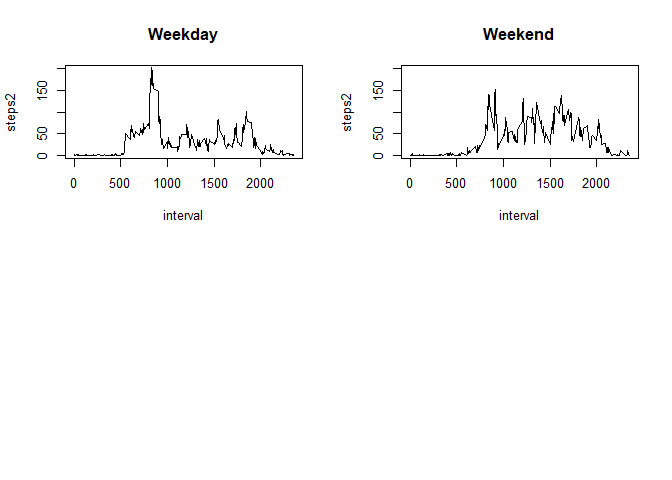

## Loading and preprocessing the data

```r
v_activity<-read.csv(file='activity.csv',header=T,na.strings='NA')
v_activity$date<-as.Date(v_activity$date,'%Y-%m-%d')
```

## What is mean total number of steps taken per day?

```r
v_steps_by_day<-aggregate(steps~date,v_activity,sum)
hist(v_steps_by_day$steps)
```

<!-- -->

## What is the average daily activity pattern?

```r
aggregate(steps~date,v_activity,mean)
```

```
##          date      steps
## 1  2012-10-02  0.4375000
## 2  2012-10-03 39.4166667
## 3  2012-10-04 42.0694444
## 4  2012-10-05 46.1597222
## 5  2012-10-06 53.5416667
## 6  2012-10-07 38.2465278
## 7  2012-10-09 44.4826389
## 8  2012-10-10 34.3750000
## 9  2012-10-11 35.7777778
## 10 2012-10-12 60.3541667
## 11 2012-10-13 43.1458333
## 12 2012-10-14 52.4236111
## 13 2012-10-15 35.2048611
## 14 2012-10-16 52.3750000
## 15 2012-10-17 46.7083333
## 16 2012-10-18 34.9166667
## 17 2012-10-19 41.0729167
## 18 2012-10-20 36.0937500
## 19 2012-10-21 30.6284722
## 20 2012-10-22 46.7361111
## 21 2012-10-23 30.9652778
## 22 2012-10-24 29.0104167
## 23 2012-10-25  8.6527778
## 24 2012-10-26 23.5347222
## 25 2012-10-27 35.1354167
## 26 2012-10-28 39.7847222
## 27 2012-10-29 17.4236111
## 28 2012-10-30 34.0937500
## 29 2012-10-31 53.5208333
## 30 2012-11-02 36.8055556
## 31 2012-11-03 36.7048611
## 32 2012-11-05 36.2465278
## 33 2012-11-06 28.9375000
## 34 2012-11-07 44.7326389
## 35 2012-11-08 11.1770833
## 36 2012-11-11 43.7777778
## 37 2012-11-12 37.3784722
## 38 2012-11-13 25.4722222
## 39 2012-11-15  0.1423611
## 40 2012-11-16 18.8923611
## 41 2012-11-17 49.7881944
## 42 2012-11-18 52.4652778
## 43 2012-11-19 30.6979167
## 44 2012-11-20 15.5277778
## 45 2012-11-21 44.3993056
## 46 2012-11-22 70.9270833
## 47 2012-11-23 73.5902778
## 48 2012-11-24 50.2708333
## 49 2012-11-25 41.0902778
## 50 2012-11-26 38.7569444
## 51 2012-11-27 47.3819444
## 52 2012-11-28 35.3576389
## 53 2012-11-29 24.4687500
```

```r
aggregate(steps~date,v_activity,median)
```

```
##          date steps
## 1  2012-10-02     0
## 2  2012-10-03     0
## 3  2012-10-04     0
## 4  2012-10-05     0
## 5  2012-10-06     0
## 6  2012-10-07     0
## 7  2012-10-09     0
## 8  2012-10-10     0
## 9  2012-10-11     0
## 10 2012-10-12     0
## 11 2012-10-13     0
## 12 2012-10-14     0
## 13 2012-10-15     0
## 14 2012-10-16     0
## 15 2012-10-17     0
## 16 2012-10-18     0
## 17 2012-10-19     0
## 18 2012-10-20     0
## 19 2012-10-21     0
## 20 2012-10-22     0
## 21 2012-10-23     0
## 22 2012-10-24     0
## 23 2012-10-25     0
## 24 2012-10-26     0
## 25 2012-10-27     0
## 26 2012-10-28     0
## 27 2012-10-29     0
## 28 2012-10-30     0
## 29 2012-10-31     0
## 30 2012-11-02     0
## 31 2012-11-03     0
## 32 2012-11-05     0
## 33 2012-11-06     0
## 34 2012-11-07     0
## 35 2012-11-08     0
## 36 2012-11-11     0
## 37 2012-11-12     0
## 38 2012-11-13     0
## 39 2012-11-15     0
## 40 2012-11-16     0
## 41 2012-11-17     0
## 42 2012-11-18     0
## 43 2012-11-19     0
## 44 2012-11-20     0
## 45 2012-11-21     0
## 46 2012-11-22     0
## 47 2012-11-23     0
## 48 2012-11-24     0
## 49 2012-11-25     0
## 50 2012-11-26     0
## 51 2012-11-27     0
## 52 2012-11-28     0
## 53 2012-11-29     0
```

```r
v_steps_by_interval<-aggregate(steps~interval,v_activity,mean)
with(v_steps_by_interval,plot.ts(interval,steps,type='l'))
```

<!-- -->

```r
v_sorted_steps_by_interval<-v_steps_by_interval[order(v_steps_by_interval$steps,decreasing=T),]
v_max_steps<-v_sorted_steps_by_interval[1,]$steps
v_sorted_steps_by_interval[v_sorted_steps_by_interval$steps==v_max_steps,]
```

```
##     interval    steps
## 104      835 206.1698
```

## Imputing missing values

```r
v_activity$steps2<-v_activity$steps

for(v_date in unique(v_activity[is.na(v_activity$steps2),]$date))
{
	if(length(v_activity[!is.na(v_activity$steps2) & v_activity$date==v_date,]$steps2)==0)
	{
		v_median<-0
	}
	else
	{
		v_median<-truncate(aggregate(steps2~date,v_activity[v_activity$date==v_date,],mean.rm=TRUE),prec=0)
	}
	v_activity[is.na(v_activity$steps2) & v_activity$date==v_date,]$steps2<-v_median
}

par(mfrow = c(2, 2))

v_steps_by_day<-aggregate(steps~date,v_activity,mean)
v_steps_by_day2<-aggregate(steps2~date,v_activity,mean)

with(v_steps_by_day,plot.ts(date,steps,type='l',main='Mean With NA'))
with(v_steps_by_day2,plot.ts(date,steps2,type='l',main='Mean Without NA'))

v_steps_by_day<-aggregate(steps~date,v_activity,median)
v_steps_by_day2<-aggregate(steps2~date,v_activity,median)

with(v_steps_by_day,plot.ts(date,steps,type='l',main='Median With NA'))
with(v_steps_by_day2,plot.ts(date,steps2,type='l',main='Median Without NA'))
```

<!-- -->

## Are there differences in activity patterns between weekdays and weekends?

```r
v_activity$day<-'Weekday'
v_activity[weekdays(v_activity$date,abbreviate=TRUE) %in% c('sáb.','dom.'),]$day<-'Weekend'

par(mfrow = c(2, 2))

with(aggregate(steps2~interval,v_activity[v_activity$day=='Weekday',],mean),plot(interval,steps2,ylim=c(0,200),main='Weekday',type='l'))
with(aggregate(steps2~interval,v_activity[v_activity$day=='Weekend',],mean),plot(interval,steps2,ylim=c(0,200),main='Weekend',type='l'))
```

<!-- -->
